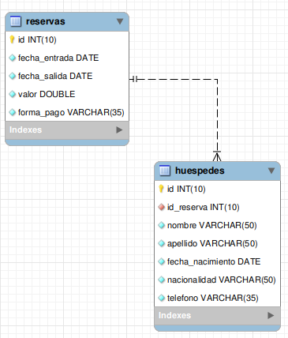

# Challenge ONE G5 | Java | Back-end | Hotel Alura


## El desafío:

El Hotel Alura conocido por su espectaculares instalaciones y paquetes promocionales para Desarrolladores de Software está teniendo problemas para llevar el control de las reservaciones hechas por sus clientes, por eso solicitan nuestra ayuda para desarrollar un sistema de reserva que contenga:
```
*Sistema de autenticación de usuario para que solo usuarios pertenecientes al hotel consigan acceder al sistema;

*Permitir crear, editar y eliminar una reserva para los clientes;

*Buscar en la base de datos todas las informaciones tanto de los clientes como de las reservas;

*Registrar, editar y eliminar datos de los huéspedes;

*Calcular el valor de la reserva en base a la cantidades de días de la reserva y a una tasa diaria que puede ser asignada por ti y en la moneda local de tu país, por ejemplo si tenemos una reserva de 3 dias y el valor de nuestra diaria son 20$ debemos multiplicar esos 3 dias por el valor de la diaria, lo que serian 60$, todo esto deberá ser hecho automaticamente y mostrado al usuario antes de guardar la reserva;

*Base de datos para almacenar todos los datos pedidos anteriormente.
```
> En este caso la tariga diaria de establecio a $ 30.000 COP

## Tecnologías Utilizadas:
```
* Java 11
* Eclipse
* Biblioteca JCalendar
* MySql 8.0.30
* Maven
```


## Diagrama de base de datos:



## Interfaz implementada:

#### INICIO DE SESIÓN

#### MENÚ PRINCIPAL

#### REGISTRO DE NUEVA RESERVA

#### REGISTRO DE HUESPED

#### SECCIÓN DE BÚSQUEDA


